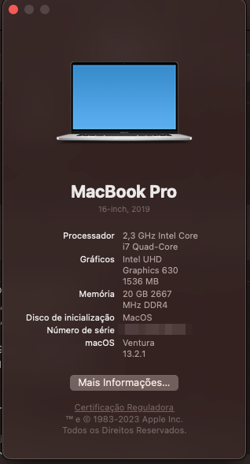

# Notebook Dell Inspiron 5490 - i7 10510U + iGPU

# EFI Details
**Latest working macOS**: 13.2.1
 
**Current OpenCore**: 0.8.8
 
 

# Specifications
|Item|Description|
|-|:-------:|
|CPU|Intel(R) Core(TM) i7-10510U|
|Memory|4Gb + 16Gb
|Storage|NVMe 256Gb|
|GPU|Intel(R) UHD Graphics 630|
|GPU|Nvidia MX 330 2Gb (Unsupported)|
|Ethernet|N/A|
|WLAN|Intel Wi-Fi|
|Bluetooth|Intel Bluetooth(R)|
|Audio|Realtek HD Audio Controller|
|Display|14" 60Hz|
|Webcam|USB Buil-in|
|Card Reader|USB Built-in|
|TouchPad & Keyboard|HID I2C|

### Working features
- Intel UHD Graphics 630 (1536 Mb)
- HDMI
- Audio 
- Microphone
- Webcam
- All USB ports
- Wifi / Bluetooth
- Keyboard
- Trackpad

### Don't work
- Sleep
- Brightness control
- Nvidia MX 330 2Gb(Unsupported)
- Ethernet(Unavailable)

### Not tested
- Card Reader
